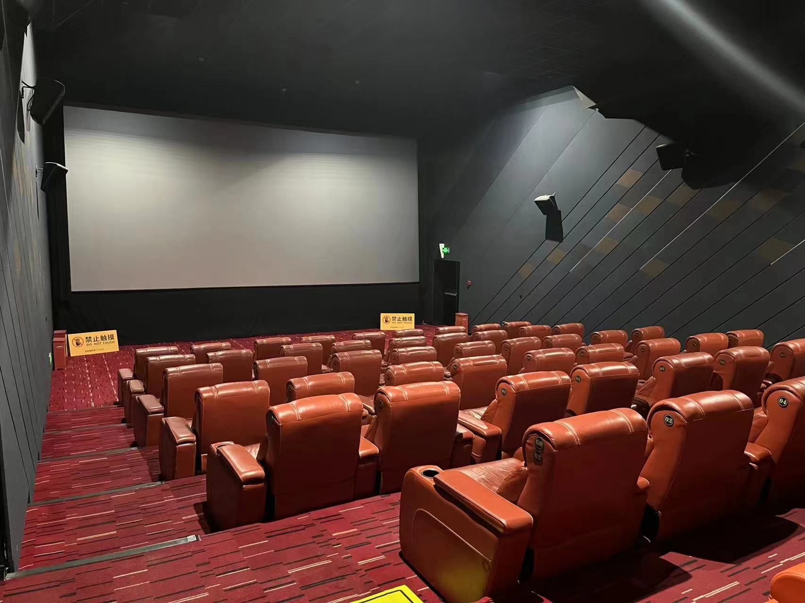
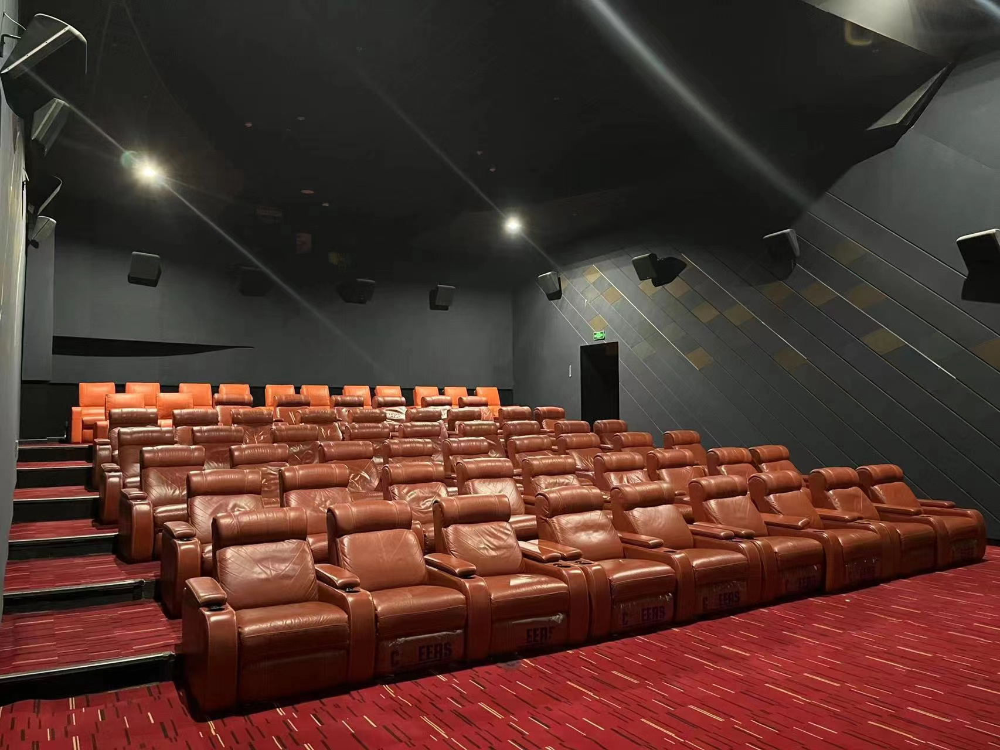
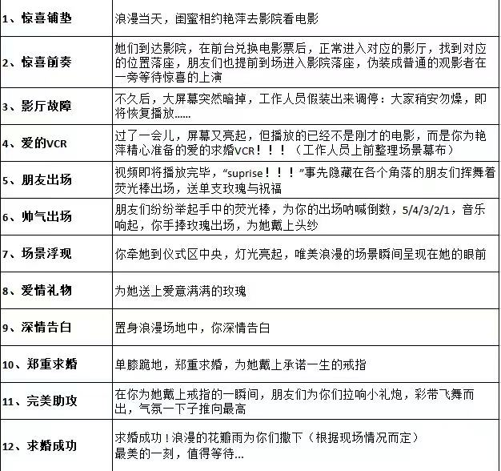
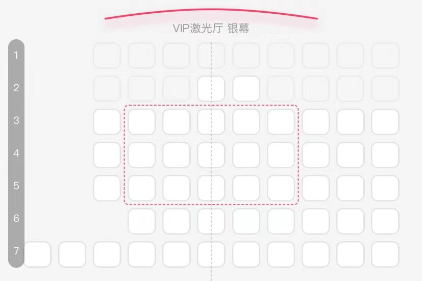

# PredictionForYou模型使用说明

## 模型简介
本模型发布版本号V4.16, 应用场景包括求婚等各种大型惊喜活动，由于场景特殊性，因此仅在特定服务器和时间开放使用。

### 测试服务器地址
```
ssh 新中关购物中心B1层金逸影城1号VIP激光厅（地铁从海淀黄庄站A2口出）
passwd: 去预定的VIP厅
```




### 模型测试时间
开放测试时间：本周六（2022.4.16号）下午。
```2～4点```准备运行环境(布置场景)和预测试(彩排)，
```4～6点```开始正式Inference流程(电影开始和求婚流程)，
请于```3点```之前登入服务器进行预测试

### 模型核心Layer（视情况作出调整）


### 模型参数
- **策划团队“多年”活动策划/场地布置经验**
- **求婚VCR**
- **道具**

### Input data介绍
大小约30人～40人（含男女主）。麻烦家里有相机的朋友们方便的话带一下相机，电影院光线较暗，用相机拍效果比较好，感谢感谢。

存储路径：登入服务器后再进行分配，初步计划女主坐中间，女主朋友们坐前排，男主朋友们坐后排



补充：合影结束后大概5点半，晚上再请大家吃饭

### Output
惊喜

### Evaluation
视情况而定
